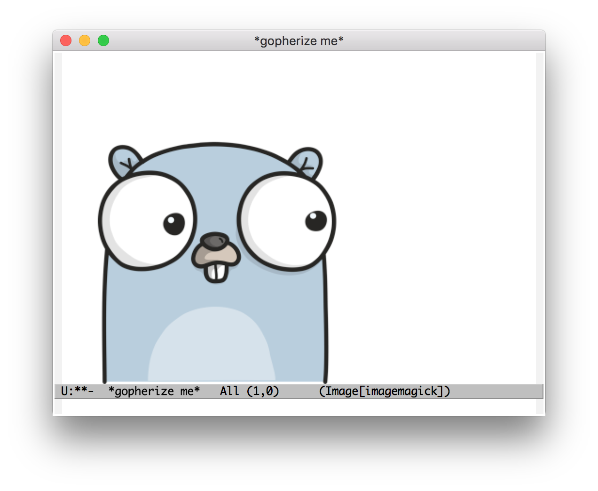

# gopherize.me for Emacs

Call [gopherize.me](https://gopherize.me/) API and show image into buffer. This package is inspired by [Gopher](https://github.com/taxpon/gopher).

## Screenshot

## Usage

#### `M-x gopherize-me`

Show gopherize image into `*gopherize me*` buffer.
